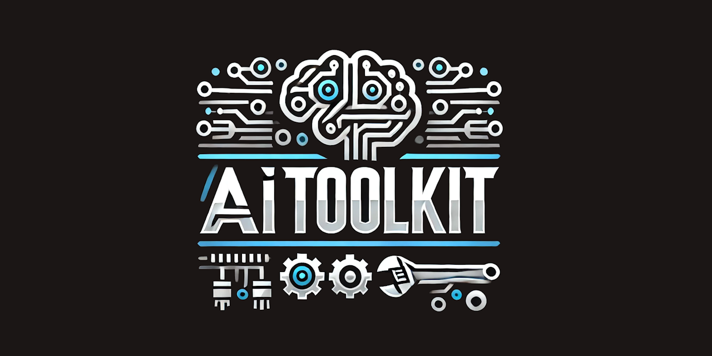

  

  

## 🚀 AIToolkit – Unlock Local Generative AI in Delphi!

🔹 **AIToolkit** is a powerful yet intuitive framework for **Delphi** developers, enabling **local generative AI** directly on your desktop—no cloud, no dependencies, just pure **on-device AI**!  

⚡ **Powered by llama.cpp**, AIToolkit provides a **lightweight, efficient**, and **extendable** set of **classes and routines**, giving you full control over how you integrate AI into your applications. Whether you're building **chatbots 🤖, creative content generators ✨, or AI-powered tools 🔧**, this toolkit serves as your **foundation** to innovate without limits.  

💡 **Easy to use, simple yet elegant**, AIToolkit lets you customize and expand its features **to your heart’s desire**—tailor it to fit your needs and build something truly unique!  

🔍 Here's a sneak peek at some of AIToolkit’s powerful features: Pre-built classes for messages, inference, function calling (tools), utilities, and more—giving you a solid foundation to build and expand upon! 🚀

🔥 **Start creating with AIToolkit today and bring AI to your Delphi projects!**  

👉 **Ready to dive in?** [Get started now!](https://github.com/tinyBigGAMES/AIToolkit/archive/refs/heads/main.zip) 🚀 (*see the usage notes in `UTestbed.pas`*)

---

**🚧 Note:** This repository is currently in the setup phase, and documentation is not yet available. However, the code is **fully functional** and generally **stable**. Stay tuned—this README, along with the documentation and other resources, will be updated soon! 🚀

---

## 🛠️ Key Functionalities

### 🖥️ Model Loading & GPU Optimization  
- AIToolkit allows you to load **multiple models** across **CPU, GPU, or a hybrid setup**.  
- Control GPU usage with:  
  - 🎯 **`MainGPU`** – Select which GPU device to use.  
  - 📊 **`GPULayers`** – Define how many layers to load on the GPU:  
    - `GPULayers = 0` ➝ Model runs fully on **CPU**.  
    - `GPULayers = N` ➝ N layers load onto **GPU**, the rest remain in **system memory**.  
    - `MainGPU = -1 & GPULayers = -1` ➝ **Auto-selects the best GPU** and loads the model fully onto it.  

#### 📥 Download & Setup  
1. **Download the model** from our **Hugging Face** account:  
   - [DeepSeek-R1-Distill-Llama-8B-Abliterated (Q4_K_M-GGUF)](https://huggingface.co/tinybiggames/DeepSeek-R1-Distill-Llama-8B-abliterated-Q4_K_M-GGUF/resolve/main/deepseek-r1-distill-llama-8b-abliterated-q4_k_m.gguf?download=true)  
2. **Place the model in your desired directory** (example directory used in code):  
   - 📂 `C:/LLM/GGUF`  

### 🔄 Always Up-to-Date with Llama.cpp  
- ✅ Stays aligned with the **latest llama.cpp** releases for **performance & compatibility improvements**.  

### 🛠️ Modular Kit-Based Design  
- Everything is in **kit form** (Messages, Inference, Tools, etc.), so you can **mix, match, and extend** as needed.  

### 🔍 Web Search Integration  
- 🌐 Powered by **Tavily.com** for **seamless web search capabilities**.  
- 🆓 **Get your search API key** from [Tavily](https://tavily.com/)  
  - 🎁 Includes **1,000 free tokens per month**  
  - 🔑 **Set up your API key**:  
    - Create an **environment variable** named **`TAVILY_API_KEY`** and assign it to your API key.  

### ⚙️ Automated Tool Registration  
- 🔧 **Auto-registers tools** from published **static class methods**.  
- 📜 **Generates JSON schema** required for LLM tool execution—no manual setup needed!  

## 📺 Media

🌊 Deep Dive Podcast  
Discover in-depth discussions and insights about AIToolkit and its innovative features. 🚀✨

https://github.com/user-attachments/assets/8dc0d7af-c2af-4e7a-a5f7-bf8ead2b7e80

🚀 AIToolkit in Action!  
🌐 Showing how it will use the 🔎 **web_search** tool to get the latest 📢 up-to-date information.

https://github.com/user-attachments/assets/14c306d2-114e-4121-8171-a5c500a804b8

## 🛠️ Support and Resources

- 🐞 **Report issues** via the [Issue Tracker](https://github.com/tinyBigGAMES/AIToolkit/issues).
- 💬 **Engage in discussions** on the [Forum](https://github.com/tinyBigGAMES/AIToolkit/discussions) and [Discord](https://discord.gg/tPWjMwK).
- 📚 **Learn more** at [Learn Delphi](https://learndelphi.org).

## 🤝 Contributing  

Contributions to **✨ AIToolkit** are highly encouraged! 🌟  
- 🐛 **Report Issues:** Submit issues if you encounter bugs or need help.  
- 💡 **Suggest Features:** Share your ideas to make **AIToolkit** even better.  
- 🔧 **Create Pull Requests:** Help expand the capabilities and robustness of the library.  

Your contributions make a difference! 🙌✨

#### Contributors 👥🤝
 

## 📜 Licensing

**AIToolkit** is distributed under the **🆓 BSD-3-Clause License**, allowing for redistribution and use in both source and binary forms, with or without modification, under specific conditions.  
See the [📜 LICENSE](https://github.com/tinyBigGAMES/AIToolkit?tab=BSD-3-Clause-1-ov-file#BSD-3-Clause-1-ov-file) file for more details.

---

🛠️ AIToolkit – Empower Your Delphi Projects with Local AI, Simple, Fast, and Limitless! 🚀🤖

<h5 align="center">
  
Made with ❤️ in Delphi  
